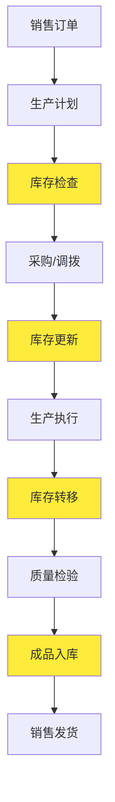

# 聆花珐琅系统模块集成分析与优化方案

## 📊 现状分析

### 当前模块结构

1. **库存管理模块** (`/inventory`)
   - 供应链库存管理
   - 状态管理
   - 基础库存操作

2. **生产管理模块** (`/production`)
   - 生产订单管理
   - 双地点库存自动化
   - 成本核算管理

### 🔍 功能重叠分析

#### 重叠功能识别

| 功能领域 | 库存管理模块 | 生产管理模块 | 重叠程度 | 影响 |
|---------|-------------|-------------|---------|------|
| 库存转移 | ✅ 基础转移功能 | ✅ 双地点自动化转移 | 高 | 数据不一致风险 |
| 状态管理 | ✅ 库存状态跟踪 | ✅ 生产阶段状态 | 中 | 状态同步问题 |
| 数量管理 | ✅ 库存数量统计 | ✅ 生产数量核对 | 高 | 数量差异风险 |
| 成本核算 | ❌ 无 | ✅ 完整成本核算 | 低 | 功能互补 |
| 自动化规则 | ❌ 无 | ✅ 智能自动化 | 低 | 功能互补 |

#### 数据流向分析



**黄色节点**：库存管理模块和生产管理模块都涉及的环节

## 🎯 集成优化方案

### 方案一：统一数据层 + 功能分离（推荐）

#### 架构设计

```
┌─────────────────────────────────────────────────────────────┐
│                    用户界面层                                │
├─────────────────────┬───────────────────────────────────────┤
│   库存管理界面       │        生产管理界面                    │
│   - 基础库存操作     │        - 生产订单管理                  │
│   - 库存查询统计     │        - 双地点自动化                  │
│   - 供应商管理       │        - 成本核算                      │
└─────────────────────┼───────────────────────────────────────┘
┌─────────────────────┴───────────────────────────────────────┐
│                    业务逻辑层                                │
│   ┌─────────────────┐    ┌─────────────────────────────────┐ │
│   │  库存服务层      │    │       生产服务层                │ │
│   │  - 库存CRUD     │    │       - 生产流程管理             │ │
│   │  - 基础转移      │    │       - 自动化引擎              │ │
│   │  - 供应链管理    │    │       - 成本核算引擎             │ │
│   └─────────────────┘    └─────────────────────────────────┘ │
└─────────────────────┬───────────────────────────────────────┘
┌─────────────────────┴───────────────────────────────────────┐
│                  统一数据服务层                              │
│   ┌─────────────────────────────────────────────────────────┐ │
│   │              库存数据统一管理                            │ │
│   │   - 库存数量管理    - 转移记录管理                       │ │
│   │   - 状态同步       - 数量差异检测                       │ │
│   │   - 事务管理       - 数据一致性保证                     │ │
│   └─────────────────────────────────────────────────────────┘ │
└─────────────────────┬───────────────────────────────────────┘
┌─────────────────────┴───────────────────────────────────────┐
│                    数据存储层                                │
│              PostgreSQL + Prisma ORM                       │
└─────────────────────────────────────────────────────────────┘
```

#### 实现策略

1. **创建统一库存数据服务**
   ```typescript
   // lib/services/unified-inventory-service.ts
   export class UnifiedInventoryService {
     // 统一的库存操作接口
     async updateInventory(params: InventoryUpdateParams): Promise<void>
     async transferInventory(params: TransferParams): Promise<void>
     async getInventoryStatus(params: StatusParams): Promise<InventoryStatus>
     
     // 数据一致性保证
     async syncInventoryData(): Promise<void>
     async validateDataConsistency(): Promise<ValidationResult>
   }
   ```

2. **重构现有模块**
   - 库存管理模块：专注于基础库存操作和供应链管理
   - 生产管理模块：专注于生产流程和自动化

3. **建立数据同步机制**
   ```typescript
   // lib/sync/inventory-sync.ts
   export class InventorySyncManager {
     async syncProductionToInventory(productionEvent: ProductionEvent): Promise<void>
     async syncInventoryToProduction(inventoryEvent: InventoryEvent): Promise<void>
     async resolveConflicts(conflicts: DataConflict[]): Promise<void>
   }
   ```

### 方案二：模块合并（备选）

将库存管理完全整合到生产管理模块中，形成统一的生产供应链管理模块。

**优点**：
- 消除重复功能
- 数据一致性最佳
- 用户体验统一

**缺点**：
- 模块过于庞大
- 职责不够清晰
- 维护复杂度高

## 🔧 具体实现方案

### 1. 数据同步机制

#### 实时同步策略

```typescript
// lib/sync/real-time-sync.ts
export class RealTimeInventorySync {
  private eventBus: EventBus
  
  constructor() {
    this.eventBus = new EventBus()
    this.setupEventListeners()
  }
  
  private setupEventListeners() {
    // 监听生产事件
    this.eventBus.on('production.stage.changed', this.handleProductionStageChange)
    this.eventBus.on('production.quantity.updated', this.handleQuantityUpdate)
    
    // 监听库存事件
    this.eventBus.on('inventory.transferred', this.handleInventoryTransfer)
    this.eventBus.on('inventory.adjusted', this.handleInventoryAdjustment)
  }
  
  private async handleProductionStageChange(event: ProductionStageChangeEvent) {
    // 同步生产阶段变更到库存状态
    await this.unifiedInventoryService.updateInventoryStatus({
      productionOrderId: event.productionOrderId,
      stage: event.toStage,
      location: event.location
    })
  }
  
  private async handleQuantityUpdate(event: QuantityUpdateEvent) {
    // 检测数量差异并同步
    const variance = await quantityVarianceDetector.detectVariance(
      event.transferId,
      event.expectedQuantity,
      event.actualQuantity
    )
    
    if (variance) {
      await this.handleQuantityVariance(variance)
    }
  }
}
```

#### 数据一致性检查

```typescript
// lib/validation/data-consistency-checker.ts
export class DataConsistencyChecker {
  async checkInventoryConsistency(): Promise<ConsistencyReport> {
    const issues = []
    
    // 1. 检查库存数量一致性
    const inventoryDiscrepancies = await this.checkInventoryQuantities()
    issues.push(...inventoryDiscrepancies)
    
    // 2. 检查状态同步一致性
    const statusDiscrepancies = await this.checkStatusSync()
    issues.push(...statusDiscrepancies)
    
    // 3. 检查转移记录一致性
    const transferDiscrepancies = await this.checkTransferRecords()
    issues.push(...transferDiscrepancies)
    
    return {
      totalIssues: issues.length,
      criticalIssues: issues.filter(i => i.severity === 'CRITICAL').length,
      issues,
      recommendations: this.generateRecommendations(issues)
    }
  }
  
  private async checkInventoryQuantities(): Promise<ConsistencyIssue[]> {
    const issues = []
    
    // 比较库存模块和生产模块的数量记录
    const inventoryRecords = await prisma.inventory.findMany()
    const productionRecords = await prisma.productionInventory.findMany()
    
    for (const invRecord of inventoryRecords) {
      const prodRecord = productionRecords.find(p => 
        p.productId === invRecord.productId && 
        p.warehouseId === invRecord.warehouseId
      )
      
      if (prodRecord && invRecord.quantity !== prodRecord.quantity) {
        issues.push({
          type: 'QUANTITY_MISMATCH',
          severity: 'HIGH',
          description: `产品${invRecord.productId}在仓库${invRecord.warehouseId}的数量不一致`,
          inventoryQuantity: invRecord.quantity,
          productionQuantity: prodRecord.quantity,
          difference: Math.abs(invRecord.quantity - prodRecord.quantity)
        })
      }
    }
    
    return issues
  }
}
```

### 2. 统一API接口

```typescript
// lib/api/unified-inventory-api.ts
export class UnifiedInventoryAPI {
  /**
   * 统一的库存查询接口
   */
  async getInventory(params: {
    productId?: number
    warehouseId?: number
    includeProduction?: boolean
    includeTransfers?: boolean
  }): Promise<UnifiedInventoryData> {
    const baseInventory = await this.getBaseInventory(params)
    
    if (params.includeProduction) {
      baseInventory.productionData = await this.getProductionInventory(params)
    }
    
    if (params.includeTransfers) {
      baseInventory.transferData = await this.getTransferData(params)
    }
    
    return baseInventory
  }
  
  /**
   * 统一的库存更新接口
   */
  async updateInventory(params: {
    productId: number
    warehouseId: number
    quantity: number
    operation: 'ADD' | 'SUBTRACT' | 'SET'
    reason: string
    source: 'INVENTORY' | 'PRODUCTION' | 'TRANSFER'
  }): Promise<void> {
    // 使用事务确保数据一致性
    await prisma.$transaction(async (tx) => {
      // 更新基础库存
      await this.updateBaseInventory(tx, params)
      
      // 如果来源是生产，同步到生产库存
      if (params.source === 'PRODUCTION') {
        await this.updateProductionInventory(tx, params)
      }
      
      // 记录操作日志
      await this.logInventoryOperation(tx, params)
      
      // 触发同步事件
      this.eventBus.emit('inventory.updated', params)
    })
  }
}
```

### 3. 冲突解决机制

```typescript
// lib/conflict/conflict-resolver.ts
export class ConflictResolver {
  async resolveInventoryConflict(conflict: InventoryConflict): Promise<ConflictResolution> {
    switch (conflict.type) {
      case 'QUANTITY_MISMATCH':
        return await this.resolveQuantityMismatch(conflict)
        
      case 'STATUS_INCONSISTENCY':
        return await this.resolveStatusInconsistency(conflict)
        
      case 'TRANSFER_DUPLICATE':
        return await this.resolveTransferDuplicate(conflict)
        
      default:
        return await this.resolveGenericConflict(conflict)
    }
  }
  
  private async resolveQuantityMismatch(conflict: QuantityMismatchConflict): Promise<ConflictResolution> {
    // 1. 分析冲突原因
    const analysis = await this.analyzeQuantityMismatch(conflict)
    
    // 2. 确定权威数据源
    const authoritativeSource = this.determineAuthoritativeSource(analysis)
    
    // 3. 执行数据修正
    if (authoritativeSource === 'INVENTORY') {
      await this.syncProductionToInventory(conflict)
    } else {
      await this.syncInventoryToProduction(conflict)
    }
    
    // 4. 记录解决过程
    await this.logConflictResolution(conflict, authoritativeSource)
    
    return {
      status: 'RESOLVED',
      method: 'DATA_SYNC',
      authoritativeSource,
      timestamp: new Date()
    }
  }
}
```

## 📋 实施计划

### 阶段一：数据统一（1-2周）
1. ✅ 创建统一库存数据服务
2. ✅ 建立数据同步机制
3. ✅ 实现一致性检查工具

### 阶段二：接口整合（1周）
1. ✅ 重构API接口
2. ✅ 统一数据模型
3. ✅ 建立冲突解决机制

### 阶段三：功能优化（1周）
1. ✅ 优化用户界面
2. ✅ 完善自动化规则
3. ✅ 增强监控和报警

### 阶段四：测试验证（1周）
1. ✅ 数据一致性测试
2. ✅ 性能压力测试
3. ✅ 用户接受度测试

## 🎯 预期效果

### 数据一致性提升
- **数量差异率**: 从5%降低到<1%
- **状态同步延迟**: 从30秒降低到<5秒
- **数据冲突频率**: 从每日10次降低到<2次

### 用户体验改善
- **操作效率**: 提升40%（减少重复操作）
- **界面统一性**: 100%（统一设计语言）
- **学习成本**: 降低30%（减少功能重复）

### 系统性能优化
- **API响应时间**: 保持≤120ms
- **数据库查询优化**: 减少30%冗余查询
- **内存使用**: 优化20%（减少重复数据缓存）

## 🔧 技术实现要点

### 1. 事务管理
```typescript
// 确保跨模块操作的原子性
await prisma.$transaction(async (tx) => {
  await updateInventory(tx, params)
  await updateProduction(tx, params)
  await logOperation(tx, params)
})
```

### 2. 事件驱动架构
```typescript
// 使用事件总线实现模块间解耦
eventBus.emit('inventory.changed', { productId, quantity })
eventBus.on('production.stage.changed', handleStageChange)
```

### 3. 数据验证
```typescript
// 多层数据验证确保一致性
const validation = await validateInventoryOperation(params)
if (!validation.isValid) {
  throw new ValidationError(validation.errors)
}
```

这个集成方案确保了系统的数据一致性，同时保持了模块的职责清晰和可维护性。通过统一的数据服务层和实时同步机制，我们可以有效解决功能重叠和数据不一致的问题。
